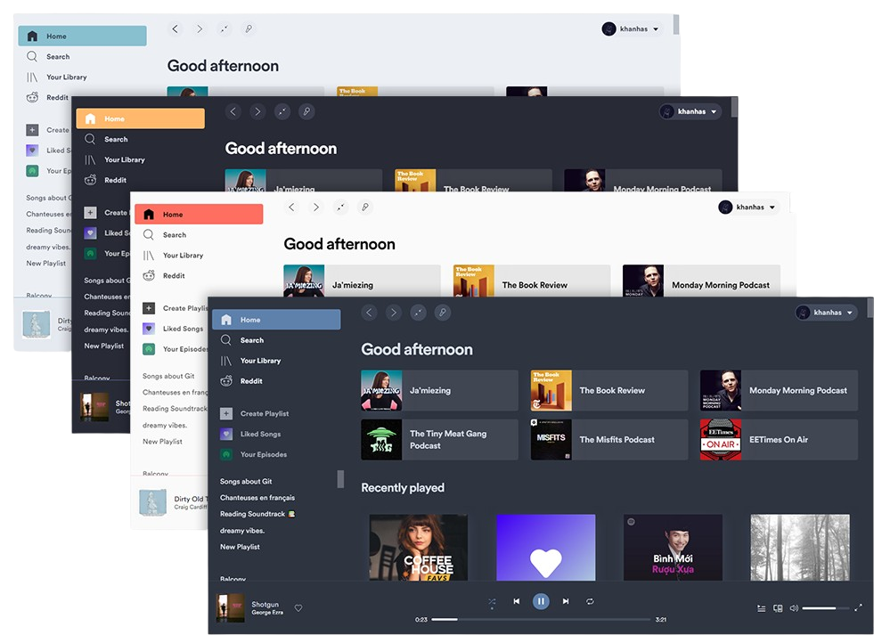

<h3 align="center"></a></h3>

  
  
  
  
  

---

Graphical tool to customize the official Spotify client through spicetify-cli.
Supports Windows, MacOS and Linux.

  

### Features
- Toggle themes and extensions
- View and edit config file within the app
- View installed themes and extensions

### Links for cli application
- [Installation](https://spicetify.app/docs/getting-started)
- [Basic Usage](https://spicetify.app/docs/getting-started#basic-usage)
- [FAQ](https://spicetify.app/docs/faq)
